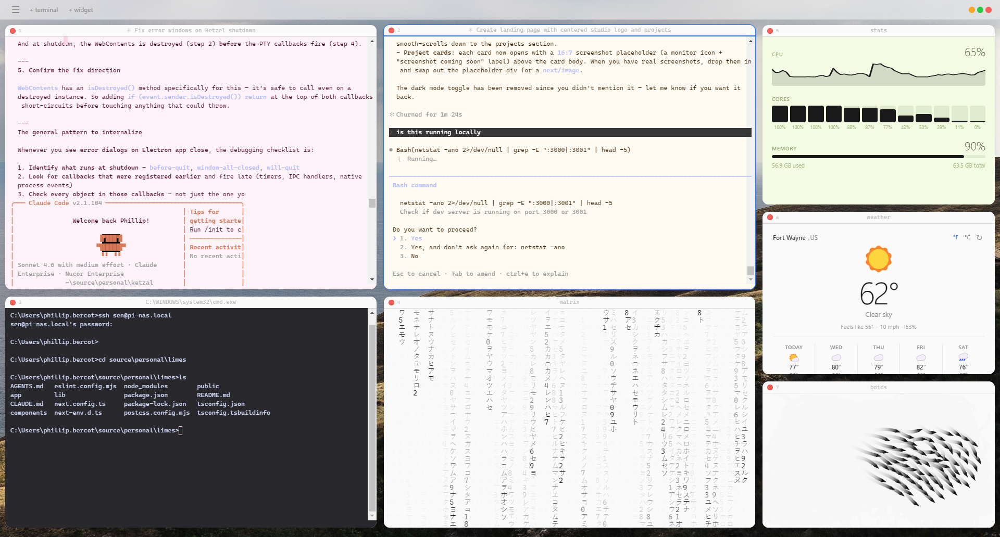

# Ketzal

A minimalist developer dashboard for Windows. Tiling terminal panes and widget panels in a floating-window layout.



## Features

- **Tiling layout** — drag and resize panes freely with react-mosaic
- **Terminals** — full PTY terminals via node-pty + xterm.js, cmd.exe by default, live titles from OSC sequences
- **Widgets**
  - Weather — current conditions + 5-day forecast via Open-Meteo (no API key required)
  - Pomodoro — 25/5/15 min focus timer with session tracking
  - To-do — persistent task list (saved to localStorage)
- **5 themes** — Light, Dark, Solarized, Light Blue, Lime Green
- **Background image** — set any image behind the floating cards
- **Frameless window** — custom min/max/close controls

## Tech Stack

| Layer | Library |
|---|---|
| Shell | Electron 31 |
| Build | electron-vite + Vite |
| UI | React 18 + TypeScript |
| Layout | react-mosaic-component v6 |
| Terminals | node-pty + @xterm/xterm v5 |
| Styling | Tailwind CSS + CSS custom properties |
| Persistence | electron-store v8 |

## Getting Started

```bash
npm install
npm run dev
```

> **node-pty** requires native compilation. If you see build errors after `npm install`, run:
> ```bash
> npm rebuild node-pty
> ```

## Build

```bash
npm run build
```

Output goes to `out/`.

## Project Structure

```
electron/
  main/index.ts       # Main process — PTY, IPC, store, window
  preload/index.ts    # Context bridge
src/
  App.tsx             # Layout, pane management
  components/
    Toolbar.tsx         # Top bar + window controls
    HamburgerMenu.tsx   # Theme switcher + background picker
    TerminalPane.tsx    # xterm.js terminal
    WidgetPane.tsx      # Widget router
    WeatherWidget.tsx
    PomodoroWidget.tsx
    TodoWidget.tsx
    ThemeProvider.tsx   # Theme + background context
  styles/
    index.css           # Layout, components, animations
    themes.css          # CSS custom property definitions per theme
  types.ts            # Shared types
```

## Adding a Widget

1. Create `src/components/MyWidget.tsx`
2. Add the type to `WidgetType` in `src/types.ts`
3. Add a case to `WidgetPane.tsx`
4. Add an entry to the `WIDGET_OPTIONS` array in `Toolbar.tsx`
